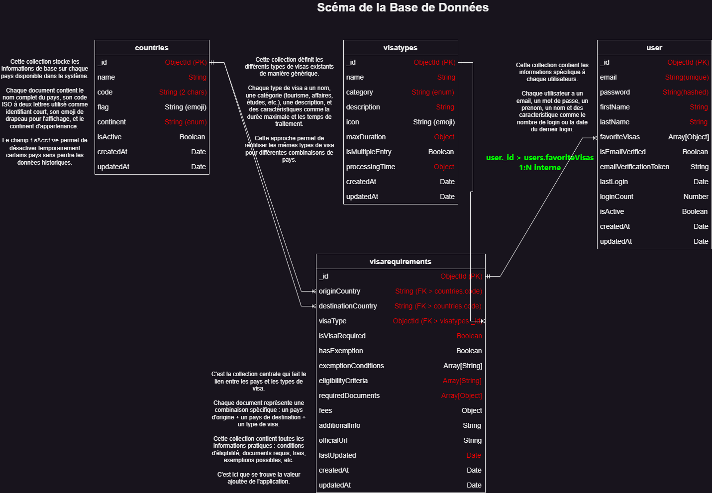

## Portfolio Project
## Technical Documentation (Stage 3)

### <ins>0. Define User Stories and Mockups</ins>

- User Stories avec priorisation MoSCoW

    ***Must Have :***

    - 1 : En tant qu'utilisateur, je veux sélectionner mon pays d'origine dans une liste ou un menu déroulant, afin de pouvoir spécifier ma nationalité pour la recherche de visas.

    - 2 : En tant qu'utilisateur, je veux choisir mon pays de destination dans une liste ou un menu déroulant, afin de définir où je souhaite voyager.

    - 3 : En tant qu'utilisateur, je veux voir la liste de tous les types de visas disponibles entre mon pays d'origine et ma destination, afin de connaître mes options de voyage.

    - 4 : En tant qu'utilisateur, je veux cliquer sur un type de visa pour voir ses détails, afin de comprendre les conditions et requirements spécifiques.

    - 5 : En tant qu'utilisateur, je veux voir les informations détaillées d'un visa (conditions d'éligibilité, documents requis, durée, coûts), afin de savoir si je peux prétendre à ce visa et comment procéder.

    - 6 : En tant qu'utilisateur, je veux naviguer facilement sur la plateforme depuis mon téléphone, afin de pouvoir faire mes recherches en mobilité.

    ***Should Have :***

    - 7 : En tant qu'utilisateur, je veux filtrer les types de visas par objectif de voyage (tourisme, travail, études), afin de réduire le nombre d'options et me concentrer sur ce qui m'intéresse.

    - 8 : En tant qu'utilisateur, je veux voir le temps de traitement estimé pour chaque visa, afin de planifier mon voyage.

    - 9 : En tant qu'utilisateur, je veux utiliser la plateforme en français ou en anglais, afin de comprendre toutes les informations dans ma langue préférée.

    - 10 : En tant qu'utilisateur, je veux pouvoir créer un compte afin de sauvegarder mes recherches et enregistrer mes informations.

    ***Could Have :***

    - 11 : En tant qu'utilisateur, je veux voir des drapeaux ou indicateurs visuels pour identifier rapidement les pays, afin de faciliter ma navigation.

    - 12 : En tant qu'utilisateur, je veux voir des informations sur les accords d'exemption de visa, afin de savoir si je peux voyager sans visa dans certains cas.

    - 13 : En tant qu'utilisateur, je veux voir des liens vers les sites officiels pour faire ma demande, afin de pouvoir entamer les démarches directement.

    - 14 : En tant qu'utilisateur, je veux voir des conseils généraux sur les documents à préparer, afin de mieux me préparer à la demande de visa.

    ***Won't Have :***

    - 15 : En tant qu'utilisateur, je ne pourrai pas remplir ou soumettre une demande de visa directement, car le MVP se limite à l'information et non au processus de demande.

    - 16 : En tant qu'utilisateur, je ne pourrai pas recevoir de notifications ou d'alertes, car cette fonctionnalité nécessite un système de comptes utilisateurs.

- Wireframe/Mockup

**Voir la maquette du site**: https://balsamiq.cloud/spqqxsz/pwwops7/r46FF

### <ins>1. Design System Architecture</ins>

***Vue d'ensemble du système***

### <ins>2. Define Components, Classes, and Database Design</ins>

- Backend - Services (Logique Métier)

    - ***Class 1: VisaService (Service de gestion des visas)***

    Contient la logique métier liées aux visas.

    **Méthode principale** : getAvailableVisas()
        
    Cette méthode prend en paramètres les codes des pays d'origine et de destination, interroge la DB pour trouver les types de visas disponible et retourne les resultats.

    - ***Class 2: CountryService (Service de gestion des pays)***

    Contient la logique métier liées aux pays.

    **Méthode principale** : getAllCountries()
        
    Cette méthode permet de recuperer la liste complète des pays (pour remplir les menu déroulants).

    - ***Class 3: VisaController (controleur de visas)***

    Lien entre requetes HTTP et services métier.

    **Méthode principale** : searchVisas()
        
    Cette méthode reçoit les paramètres de la requete utilisateur (pays d'origine, destination, filtres éventuels) puis retourne les résultats

- Frontend - Composants d'Interface

    - ***Formulaire de Recherche (Search Form)***

    Composant central de l'application, permet la selection du pays d'origine et de destination par l'utilisateur via un menu déroulant.

    - ***Carte de Visa (Visa Card)***

    Composant qui affiche les informations d'un visa de manière structurée (icone, nom, durée, frais, description).

- Database

    

### <ins>3. Create High-Level Sequence Diagrams</ins>

- ***Cas d'Usage 1 : Recherche de Visas Disponibles***

Flux principal de l'application. L'utilisateur sélectionne ses pays d'origine et de destination, puis soumet sa recherche.

- ***Cas d'Usage 2 : Consultation des Détails d'un Visa***

Ce flux permet à l'utilisateur d'approfondir ses connaissances sur un visa spécifique.

### <ins>4. Document External and Internal APIs</ins>

- ***APIs Externes***

    **APIs Gouvernementales**:

    - API Consulaire Française : Récupération des informations officielles sur les visas depuis la France
    https://api.diplomatie.gouv.fr/v1/visa-info

    **API REST Countries**:

    - Récupération de la liste complète des pays avec leurs codes ISO, drapeaux, et continents :
    https://restcountries.com/v3.1/all

    **Google Translate API**:

    - Traduction automatique des informations de visa :
    https://translation.googleapis.com/language/translate/v2

    **API de Géolocalisation**:

    -  Détection automatique du pays d'origine de l'utilisateur : 
    http://ip-api.com/json/

- ***API internes***

| Endpoint        | Méthode | Objectif                      | Paramètre Clés                      |
|-----------------| --------|-------------------------------|-------------------------------------|
| /api/visas      | GET     | Recherche principale de visas | `origin`, `destination`, `category` |
| /api/visas/{id} | GET     | Détails complet d'un visa     | `id` (ObjectId)                     |
| /api/countries  | GET     | Liste des pays disponibles    | `continent`, `active`               |
| /api/auth/register | POST | Créer un nouveau compte utilisateur | `email`, `password`, `firstName`, `lastName` |
| /api/auth/login | POST | Connecter un utilisateur existant      | `email`, `password` |
| /api/auth/logout | POST | Déconnecter l'utilisateur             | - |
| /api/user/profile | GET | Récuperer le profile utilisateur      | - |
| /api/user/profile | PUT | Mettre à jour le profil utilisateur   | - |
| /api/user/favorites | GET | Voir liste des favoris | - |
| /api/user/favorites | POST | Ajouter un favori a la liste | `visaRequirementId` |
| /api/user/favorites/{visaId} | DELETE | Retirer un favori de la liste | - |

### <ins>5. Plan SCM and QA Strategies</ins>

- ***1. Stratégie SCM (Source Code Management)***

    **Description des branches Git**

    | Branche   | Objectif                                   | Durée de vie |
    |-----------|--------------------------------------------|--------------|
    | `main`    | Code de production stable                  | Permanente   |
    | `develop` | Integration des fonctionnalités            | Permanente   |
    | `feature` | Développement de nouvelles fonctionnalités | Temporaire   |

    **Convention de nommage des commits**

    - feat: nouvelle fonctionnalité
    - fix: correction de bug
    - docs: modification de documentation
    - style: formatage du code
    - refactor: refactoring sans changement de fonctionnalité
    - test: ajout ou modification de tests

- ***2. Stratégie QA (Quality Assurance)***

    **Tests Unitaires**

    - Objectif: Tester les fonctions individuelles
    - Outils: Jest

    **Tests d'integration**

    - Objectif: Tester les interactions entre composants (API endpoints)
    - Outils: Postman

    **Tests End-to-End**

    - Objectif: Tester les parcours utilisateur complets
    - Outils: Cypress ou manuel